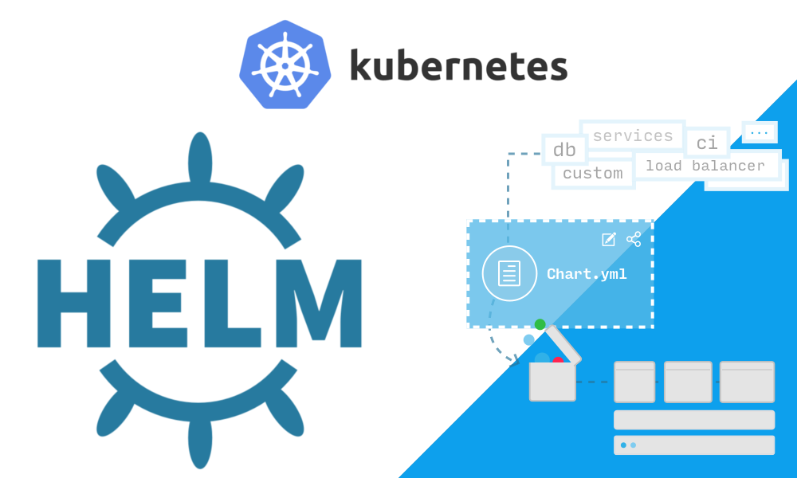

# Helm Kubernetes Package Manager

A Tutorial on Helm by @amandewatnitrr.



### Why we need Helm ??

- Let's say we are wokring on a microservice based application, that needs to be deployed on a Kubernetes cluster. The application might use a database as well, we need to come up with all the YAML files required to deploy the application on the cluster. This includes the deployment, service, ingress, configmap, secret, etc. files.

- The Problem comes here is we need to hardcode a lot of values in the YAML files, like the image name, tag, environment variables, etc. As all these files are static.

  This is not a good practice as we need to change these values for different environments like dev, staging, production, etc.

- If you look at the yaml configurations in most of the elements are same, and cannot recieve the parameters dynamically.

- When all the resources are created, when we do a kube installation, that means our application is live on the cluster are all the resources are live on the cluster.

  But, it is hard to maintain consistency if a developer or a DevOps Engineer directly goes and tweaks the resources on the Kubernetes cluster instead of updating these files, checking them into Github or pushing them to Github and then updating the Kubernetes cluster.

- If we use commands like kubectl directly on the cluster, they always have consistency issues. That is something helm will address.

- Revision History, as our applications are installed and upgraded, kubernetes doesnot maintain any version history for us. Also, if we make changes to even one of the Kubernetes Components, the whole redeployment happens again, and let's say we want to rollback to a previous version of it, it is hard to track back to unless a proper backup is maintained for this.

  For this purpose, Helm also maintains a revision history for us.

## What is Helm ??


- Helm works with Charts. Charts are like packages in Helm. They are a collection of all the resources required to run an application on a Kubernetes cluster.

- These charts will have all the template files and the configuration required to create kubernetes resources.

- We can pull the chart using a single command to pull the chart you want. Let's say to install an Apache onto k8s cluster, we use the following command:

  ```bash
  helm install apache bitnami/apache --namespace=dev
  ```
  
  where that chart lives, it pulls the chart, takes all the templates and the values in their chart, and it will create the resource file to kubernetes, which will eventually create the kubernetes resources under the namespace you provide, all with a single command.

  - Simplifying deployments: Helm charts can simplify the deployment process and make it easier to manage applications.
  - Reducing complexity: Helm can help reduce the complexity of creating different environments for development, testing, and production.
  - Improving productivity: Helm can help developers be more productive by allowing them to focus on writing code instead of deployment.
  - Streamlining CI/CD pipelines: Helm can help streamline CI/CD pipelines.
  - Automating application management: Helm can help automate the deployment and management of applications, which can improve system reliability and stability.
  - Centralizing application sharing: Helm repositories can help developers share their applications with users and help users find the applications they need.
  - Other advantages of Helm include: Maintaining a database of all release versions, Customizing application configurations during deployment, Creating custom charts, Accessing many preconfigured packages, and Organizing application components into charts.

- The Charts that we talked about are stored in Chart repositoies. Using the helm commands, we can pull and install the charts from these repositories.

## Working with Helm Chart Repositories

- To add a chart repository, we use the following command:

  ```bash
  helm repo add bitnami https://charts.bitnami.com/bitnami
  ```

  This command will add the bitnami repository to the helm.

- To list all the repositories added to the helm, we use the following command:

  ```bash
  helm repo list
  ```

- To install a chart from the repository, we use the following command:

  ```bash
  helm install apache bitnami/apache --namespace=dev
  ```

- `helm repo list` command will list all the repositories added to the helm.
- `helm repo add bitnami https://charts.bitnami.com/bitnami` command will add the bitnami repository to the helm.
- `helm repo remove bitnami` command will remove the bitnami repository from the helm.
- `helm search repo mysql` command will search for the mysql chart in the helm repositories.
- `helm search repo database` command will search for the database chart in the helm repositories.
- `helm search repo database --versions` command will search for the database chart in the helm repositories along with the versions.


## The Magic of Helm

- To experience what we can do helm and how it simplifies the deployment process, let's take an example of deploying a MySQL database on a Kubernetes cluster from bitnami repository.

  

- In order to install the MySQL database on the Kubernetes cluster, we use the following command:

  ```bash
  helm install mysql bitnami/mysql
  ```
  
  

- Once the installation is doen and completed, copy the logs from the terminal and paste it on a notepad or a text editor.

  Use the command and instructions as shown in the logs to connect to the MySQL database.

- And, thus you can easily install a MySQL database on a Kubernetes cluster using Helm. If you want to confirm, go to the terminal where you used `minikube ssh` and run the following command:

  ```bash
  docker images
  ```

  You will see the MySQL pod running on the Kubernetes cluster.

>[!NOTE]
>We can not have the same chatname in the same namespace. If we want to install the same chart again, we need to provide a different name to the chart. <br><br>For that you need to create a new namespace using the command <b>`kubectl create namespace new_manespace_name`</b> and then install the chart using the command <b>`helm install mysql1 bitnami/mysql --namespace=dev1`</b>.

## List and Uninstall the Helm Charts

- To list all the charts installed on the Kubernetes cluster, we use the following command:

  ```bash
  helm list
  ```

- If you want to list charts from a specific namespace, you can use the following command:

  ```bash
  helm list --namespace=<namespace>
  ```

  

- To uninstall a chart from the Kubernetes cluster, we use the following command:

  ```bash
  helm uninstall <chart-name>
  ```

  

## Providing Custom Values to the Helm Charts


- So, in the previous example, we installed the MySQL database on the Kubernetes cluster using the bitnami repository. But, what if we want to provide some custom values to the MySQL database like password, you can do it using `--set` flag, as follows:

  ```bash
  helm install mysql bitnami/mysql --set auth.rootPassword = test1234
  ```

- We can also use `--values` flag to provide the custom values to the helm charts. For that, we need to create a file with the custom values and provide the file path to the `--values` flag.

  ```bash
  helm install mysql bitnami/mysql --values values.yaml
  ```

  The `values.yaml` file in our case will look like:

  ```yaml
  auth:
    rootPassword: "12345678"
  ```

  Once, you have created the `values.yaml` file, you can use the following command:

  ```bash
  helm install mysql bitnami/mysql --values /path/to/values.yaml
  ```

  And, this will set the values as given in the `values.yaml` file.

## Helm Upgrade

> [!NOTE]
> `helm repo update` <br>
> These command will fetch the latest charts by going to the repository.
> 
