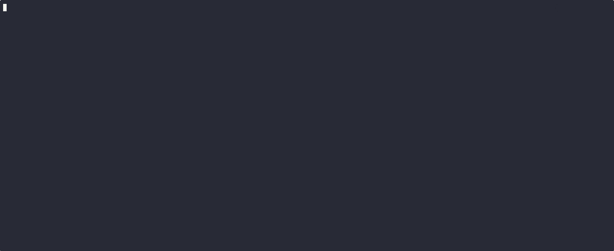

# Helm Advanced

## Helm release workflow

- Now, we will walk through the behind the scenes of Helm when we execute `helm install` command.

- This is the same process, whether you are pulling a helm chart from a remote repository or using your own chart that you have on your machine, which we will be learning in sections later on. The process is the same.

- When we execute `helm install` command, Helm does the following:

  - **Load the Chart**

    - **Local Chart**: If the chart is stored locally, Helm loads it directly from your machine.
    - **Remote Chart**: If the chart is hosted in a remote repository, Helm pulls the chart from the repository before loading it.
    - **Dependencies**: Helm resolves and loads any dependencies specified in the `Chart.yaml` file.

  - **Parse Values**
    - Helm parses the default `values.yaml` file and any other values files included in the chart.
    - These files contain the default values used to render the templates in the `templates` directory.
    - If the user provides custom values using the `--set` or `--values` flags, Helm overrides the default values with the custom values.

  - **Render Templates**
    - Helm uses the provided values (custom or default) to render the Go templates in the `templates` directory.
    - This step generates YAML files that define the Kubernetes resources to be created.

  - **Parse YAML into Kubernetes Objects**
    - The generated YAML files are parsed into Kubernetes objects (e.g., Deployments, Services, ConfigMaps).
    - Helm does not simply hand over the raw YAML to Kubernetes; it first ensures the YAML is structured correctly.

  - **Validate Kubernetes Objects**
    - Helm validates the Kubernetes objects against the Kubernetes schema.
    - If the objects are valid, Helm proceeds to generate the final YAML manifest.
    - If the objects are invalid, Helm returns an error to the user and stops the process.
  
  - **Send YAML to Kubernetes API Server**
    - Helm sends the final YAML manifest to the Kubernetes API server.
    - The API server processes the YAML and begins creating the specified resources on the cluster.
  
  - **Command Success**
    - Helm considers the `helm install` command successful as soon as the YAML is handed over to the Kubernetes API server.
    - **Note**: Helm does not wait for the resources to be fully created on the cluster. It simply ensures the YAML is accepted by the API server.

  - **Store Release Metadata**
    - Helm creates a release object to track the installation.
    - The release metadata (e.g., release name, version, values) is stored in Kubernetes Secrets or ConfigMaps for future reference.

  - **User Verification**
    - The user can verify the installation using the `helm status` command.
    - This command provides details about the release, including its status and the resources created.

- Summary
  - The `helm install` process involves loading the chart, parsing values, rendering templates, validating Kubernetes objects, and handing over the final YAML to the Kubernetes API server. Helm considers the command successful once the YAML is accepted by the API server, without waiting for resource creation. Release metadata is stored for future reference, and users can verify the installation using `helm status`.

<br/>

  ```mermaid
  flowchart TD
    A[helm install] --> B{Is chart local or remote?}
    B -->|Local| C[Load chart from local machine]
    B -->|Remote| D[Pull chart from repository]
    C --> E[Load chart dependencies]
    D --> E
    E --> F[Parse default values.yaml and other values files]
    F --> G{Does user provide custom values?}
    G -->|Yes| H[User provides values via --set or --values]
    G -->|No| I[Use default values from chart]
    H --> J[Helm overrides default values with custom values]
    I --> J
    J --> K[Render templates using provided values]
    K --> L[Generate YAML files from templates]
    L --> M[Parse YAML files into Kubernetes Objects]
    M --> N[Validate Kubernetes Objects against Kubernetes Schema]
    N -->|Valid| O[Generate final YAML manifest]
    N -->|Invalid| P[Helm returns error to user]
    O --> Q[Send YAML manifest to Kubernetes API Server]
    Q --> R[Kubernetes API Server processes YAML]
    R --> S[Helm considers command successful]
    S --> T[Helm creates and stores release metadata]
    T --> U[User can verify installation using helm status]
    U --> V[End]

  ```

## helm --dry-run

- `helm install <release-name> <chart-name> --dry-run`

  - The `--dry-run` flag is used to simulate the installation process without actually deploying the resources to the cluster.

  - This flag is useful for testing the installation process and verifying the rendered templates before deploying the resources.

  - The `helm install` command with the `--dry-run` flag does not create a release object or store any metadata in the cluster.

  

- It's a great way of debugging our chart and ensuring that whatever templates we are expecting to be generated and the values are being rendered correctly.

## helm template

- The `--dry-run` flag was introduced so that we can debug and see if the templates that are getting generated are okay for an installation or upgrade.

- But now several teams and projects have started using these templates for different purpose all together. They copy these templates generated by `--dry-run` and use them to apply to the cluster using `kubectl apply -f`.

  But they had some issues doing it because, the `--dry-run` flag with the command includes non YAML syntax or elements into these YAML files.

- The `--dry-run` flag can be used for both installation and upgrade. And, if you run it as generated it will only show the changes whih can be very confusing.

- Also, the `--dry-run` being dry run will still valdate these templates, by communicating with the API Server of the k8s cluster.

- For making our life easy, helm has given us `helm template` command. You can run the command as follows:

  ```bash
  helm template <release-name> <chart-name> --values <values-file>
  ```

  

## helm get

- `helm get` command is used to get information about a release or specific resources in a release.

  

  We have the following options with `helm get` command:

  - `helm get all <release-name>`: Get all information about a release.
  - `helm get values <release-name>`: Get the values used to render the templates in a release.
  - `helm get manifest <release-name>`: Get the rendered templates in a release.
  - `helm get notes <release-name>`: Get the notes associated with a release.
  - `helm get hooks <release-name>`: Get the hooks associated with a release.
  - `helm get metadata <release-name>`: Get the metadata associated with a release.

- Special Flags:

  - `helm get values <release-name> --all`: Get all values used to render the templates in a release.

  - `helm get values <release-name> --revision <revision-number>`: Get the values used to render the templates in a specific revision of a release.
  
## helm history

- `helm history` command is used to view the history of a release. It gives us the history of installation and updates.

- It also records the errors that occurred during the installation or upgrade process. You cans see this in the example below.

  <details>
    <Summary>Example</Summary>

    ```sh
     -> helm upgrade my-release oci://registry-1.docker.io/bitnamicharts/nginx --set image.pullPolicy=test
     
     Pulled: registry-1.docker.io/bitnamicharts/nginx:19.0.0

     Digest: sha256:2f44dab10fd9cf93faf1cd54ec5f30de3c139ad5de2c2d9d04a97f483e823e71

     Error: UPGRADE FAILED: cannot patch "my-release-nginx" with kind Deployment: Deployment.apps "my-release-nginx" is invalid: [spec.template.spec.containers[0].imagePullPolicy: Unsupported value: "test": supported values: "Always", "IfNotPresent", "Never", spec.template.spec.initContainers[0].imagePullPolicy: Unsupported value: "test": supported values: "Always", "IfNotPresent", "Never"]

     -> helm history my-release
     REVISION        UPDATED                         STATUS          CHART           APP VERSION     DESCRIPTION                                              
     1               Thu Jan 23 03:45:39 2025        superseded      nginx-18.3.5    1.27.3          Install complete
     2               Sun Feb  2 04:32:34 2025        deployed        nginx-18.3.5    1.27.3          Upgrade complete
     3               Sat Feb 15 14:00:36 2025        failed          nginx-19.0.0    1.27.4          Upgrade "my-release" failed: cannot patch "my-release-nginx" with kind Deployment: Deployment.apps "my-release-nginx" is invalid: [spec.template.spec.containers[0].imagePullPolicy: Unsupported value: "test": supported values: "Always", "IfNotPresent", "Never", spec.template.spec.initContainers[0].imagePullPolicy: Unsupported value: "test": supported values: "Always", "IfNotPresent", "Never"]
    ```

  </details>

## helm rollback

- `helm rollback` command is used to rollback a release to a previous revision.

- Example:
  
  

- And all this is using the data stored in the secrets, here below you can see:

  ```sh
  -> kubectl get secrets 

  NAME                               TYPE                 DATA   AGE

  my-release-nginx-tls               kubernetes.io/tls    3      23d
  sh.helm.release.v1.my-release.v1   helm.sh/release.v1   1      23d
  sh.helm.release.v1.my-release.v2   helm.sh/release.v1   1      13d
  sh.helm.release.v1.my-release.v3   helm.sh/release.v1   1      24m
  sh.helm.release.v1.my-release.v4   helm.sh/release.v1   1      3m52s
  ```

<br>

  > [!NOTE]
  > If you delete the release using `helm uninstall`, the secrets will also be deleted. And, hence you will not be able to rollback. In order, to be able to rollback, we need to use `--keep-history` flag with `helm uninstall`.<br><br>
  > In which case if you use, the flag you can easily rollback using the command:
>
  > ```
  > helm rollback <release-name> <revision-number>
  > ```
>
  > And, in addition to that all the history also remains retained.

  


## `helm upgrade --install`

- `helm upgrade --install` command is used to install a release if it does not exist or upgrade a release if it already exists.

- This command is useful when you want to install a release for the first time or upgrade an existing release with new values or chart version.

## `--generate-name` & `--create-namespace`

- `--generate-name` flag is used to generate a unique release name for a release.

- This flag is useful when you want Helm to generate a unique release name for you, instead of specifying a release name manually.

- Example:

  ```sh
  helm install --generate-name oci://registry-1.docker.io/bitnamicharts/nginx
  ```

- `--create-namespace` flag is used to create a new namespace if it does not exist.

- This flag is useful when you want to install a release in a new namespace that does not exist on the cluster.

- Example:

  ```sh
  helm install --create-namespace --namespace my-namespace oci://registry-1.docker.io/bitnamicharts/nginx
  ```

  

- We can also try some more things around `--generate-name` by having a template for the release name.

  ```sh
  helm install --generate-name --name-template "something-{{randAlpha 7 | lower}}" oci://registry-1.docker.io/bitnamicharts/nginx
  ```

  This will generate a release name like `something-abcde` or `something-xyzabc`.

  > [!CAUTION]
  > The `--name-template` flag is recommended to add only small case alphabets only and not Capital letters or special characters, as it may lead to errors associated to secret saying that the secret name that is derived from the release name cannot have special characters or capital letters.

  <div class="warning" style='background-color:rgb(33, 33, 33); color:rgb(255, 198, 11); border-left: solidrgb(251, 249, 128) 4px; border-radius: 4px; padding:0.7em;'>
  <span>
  <p style='margin-top:1em; text-align:center'>
  <b>Note</b></p>
  <p style='margin-left:1em;'>
  The <code>--name-template</code> flag is part of templating engine, and we will soon study in detail about this in lessons ahead.
  </p>
  <p style='margin-bottom:1em; margin-right:1em; text-align:right; font-family:Georgia'> <b>- Aman Kumar Dewangan</b> <i>(Helm Tutorial, 2025)</i>
  </p></span>
  </div>

## `--wait` & `--timeout`

- When we do a helm install, the helm install command considers the installaton to be successfull as soon as the manifest is recieved by the Kubernetes API Server. It doesn't wait for the resources to be fully created on the cluster.

  If we want that to happen we can use:

  - `--wait` flag is used to wait for all resources to be in a ready state before marking the release as successful.

    - The installation is considered successful only when all resources are in a ready state, otherwise the installation is considered failed.

    - By, default it waits for 300 seconds.

  If we want to change the timeout, we can use ``--timeout`` flag.

  - `--timeout` flag is used to specify the time to wait for all resources to be in a ready state.

    Specify the time in minutes and seconds as `xmys`, this is what we need tot just specify the time in minutes.

    - It is important to understand that image pull can take tim, depending on the netowrk bandwidth and hence we need to specify the time accordingly.

      So, the failure maynot be anything on the Kubernetes Cluster.

<details>
  <Summary>Example</Summary>

  ```sh
  helm install --wait --timeout 5m10s my-release oci://registry-1.docker.io/bitnamicharts/nginx
  ```

</details>

## atomic install

- If you don't want the installation to be marked as failure if the installation doesn't complete during specified wait time or timeout, we can use `--atomic` flag.

  - `--atomic` flag will automatically rollback to the last succesfull release if the installation fails.

    When we use `--atomic` flag, `--wait` flag is automatically enabled.

    This is helpful in CI/CD Pipelines where you don't just want to leave it at a failure state, it can rollback to a previous successfull release.

  - This helps you deal with scenarios where:

    - The installation is taking longer than expected.
    - The installation fails within the default time period
    - The installation fails due to an error in the chart or values.
    - The installation fails due to an error in the Kubernetes cluster.
    - The installation fails due to an error in the network or image pull.
    - The installation fails due to an error in the Helm or Tiller.
    - The installation fails due to an error in the API Server.
    - The installation fails due to an error in the Kubernetes resources.
    - The installation fails due to an error in the Kubernetes objects.
    - The installation fails due to an error in the Kubernetes schema.
    - The installation fails due to an error in the Kubernetes API and Server.

## Forceful Upgrades & Cleanup on Failed Updates

- `--force` flag is used to force an upgrade to a release, even if the release is in a failed state.

  This flag is useful when you want to upgrade a release that is in a failed state, without having to rollback to a previous revision.

  > [!NOTE]
  ><details>
  >  <summary>Example</summary>
  >
    >```sh
    > helm upgrade --force my-release oci://registry-1.docker.io/bitnamicharts/nginx --values values.yaml
    > ```
  >
  > This will force the upgrade to the release `my-release` even if it is in a failed state.
  > It will delete the olded resources and create new resources, as per the changes in the chart or values.
  ></details>

- `--cleanup-on-failure` flag is used to cleanup resources created during a failed upgrade. 

  This flag is useful when you want to cleanup resources created during a failed upgrade, without having to rollback to a previous revision.


  > [!NOTE]
  ><details>
  >  <summary>Example</summary>
  >
    >```sh
    > helm upgrade --cleanup-on-failure my-release oci://registry-1.docker.io/bitnamicharts/nginx --values values.yaml
    > ```
  >
  > This will cleanup resources created during a failed upgrade to the release `my-release`.
  > It will delete the resources that were created during the failed upgrade.
  ></details>