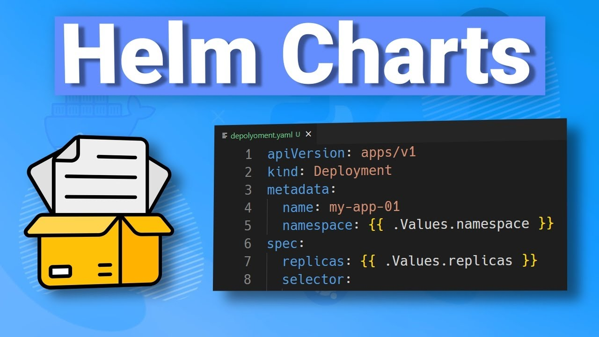

# Helm Charts



## Creating Helm Charts

> [!IMPORTANT]
>
> - In order to create a Helm Chart use the command:
>
>    ```bash
>    helm create <chart-name>
>    ```
>
>    <details>
>    <summary>Click to see the example</summary>
>
>    ```bash
>    $ helm create test-chart
>    Creating test-chart
>    ```
>
>    </details>

- If you `cd` into the `test-chart` directory, you will see the following structure:

    ```bash
    $ tree test-chart
    test-chart
    ├── Chart.yaml
    ├── charts
    ├── templates
    │   ├── NOTES.txt
    │   ├── _helpers.tpl
    │   ├── deployment.yaml
    │   ├── hpa.yaml
    │   ├── ingress.yaml
    │   ├── service.yaml
    │   ├── serviceaccount.yaml
    │   └── tests
    │       └── test-connection.yaml
    └── values.yaml

    4 directories, 10 files
    ```

- The `chart.yaml` file is where the metadata of the chart is stored.
- The `charts` folder is where the dependencies of the chart are stored, and is initially empty.
- The templates folder is where we have all the templates for the Kubernetes resources that will be created.
- `values.yaml` is where the default values for the chart are stored.

- So, let's start by installing the chart we just created:

- ```bash
    $ helm install test test-chart 

    NAME: test
    LAST DEPLOYED: Sun Feb 16 22:15:28 2025
    NAMESPACE: default
    STATUS: deployed
    REVISION: 1
    NOTES:
    1. Get the application URL by running these commands:

    export POD_NAME=$(kubectl get pods --namespace default -l "app.kubernetes.io/name=test-chart,app.kubernetes.io/instance=test" -o jsonpath="{.items[0].metadata.name}")

    export CONTAINER_PORT=$(kubectl get pod --namespace default $POD_NAME -o jsonpath="{.spec.containers[0].ports[0].containerPort}")

    echo "Visit http://127.0.0.1:8080 to use your application"

    kubectl --namespace default port-forward $POD_NAME 8080:$CONTAINER_PORT
  ```

- So, now the helm deployment is successfull, by default it's an nginx deployment. Once, done you need to fetch the `POD_NAME` and `CONTAINER_PORT` and then you can access the application using the `port-forward` command.

  

## `chart.yaml`

- The `chart.yaml` file is where the metadata of the chart is stored. It contains the following fields:

    <details>
    <summary>Click to see "charts.yaml" </summary>

    ```yaml
    apiVersion: v2
    name: test-chart
    description: A Helm chart for Kubernetes

    # A chart can be either an 'application' or a 'library' chart.
    #
    # Application charts are a collection of templates that can be packaged into versioned archives
    # to be deployed.
    #
    # Library charts provide useful utilities or functions for the chart developer. They're included as
    # a dependency of application charts to inject those utilities and functions into the rendering
    # pipeline. Library charts do not define any templates and therefore cannot be deployed.
    type: application

    # This is the chart version. This version number should be incremented each time you make changes
    # to the chart and its templates, including the app version.
    # Versions are expected to follow Semantic Versioning (https://semver.org/)
    version: 0.1.0

    # This is the version number of the application being deployed. This version number should be
    # incremented each time you make changes to the application. Versions are not expected to
    # follow Semantic Versioning. They should reflect the version the application is using.
    # It is recommended to use it with quotes.
    appVersion: "1.16.0"
    ```

    </details>

- There are 3 mandatory elements within this chart.yaml:
  - `apiVersion`: The version of the Helm chart API.
  - `name`: The name of the chart.
  - `version`: The version of the chart.

- The rest of the fields are optional, but it is recommended to fill them out. 

- The `apiVersion` determines the rest of the document, i.e. the structure that needs to be followed by the rest of the document.

  The elements that can be used, the mandatory elements and the optional elements are determined by the `apiVersion` we use here.

  - The Current version of the Helm chart API is `v2`.

- The next is the `name` of the chart. The description can be any textul information about the chart or what it does.

- The `type` of the chart can be either `application` or `library`.

  - The `application` type is a collection of templates that can be packaged into versioned archives to be deployed.

  - The `library` type provides useful utilities or functions for the chart developer.

  - They're included as a dependency of application charts to inject those utilities and functions into the rendering pipeline. Library charts do not define any templates and therefore cannot be deployed.

- The `version` is the version of the chart. This version number should be incremented each time you make changes to the chart and its templates, including the app version.

- The `appVersion` is the version number of the application being deployed. This version number should be incremented each time you make changes to the application. Versions are not expected to follow Semantic Versioning. They should reflect the version the application is using.

Other than this there are some other additional fields that can be added to the `chart.yaml` file:

- `icon`: The URL to an SVG or PNG image to be used as an icon for this chart.

  ```yaml
  icon: https://example.com/icon.png
  ```

- `keywords`: A list of keywords about the chart.

  ```yaml
  keywords:
    - nginx
    - web
    - server
  ```

- `home`: The URL of the homepage for this chart.

  ```yaml
  home: https://example.com
  ```

- `sources`: A list of URLs to source code for this chart.

  ```yaml
  sources:
    - https://example.com/foo/bar
  ```

- `maintainers`: A list of maintainers for this chart.

  ```yaml
  maintainers:
    - name: <Maintainer_name>
      email: <Maintainer_email>
    - name: <Maintainer_name>
      email: <Maintainer_email>
  ```


## Templates in Brief

- It has the templates of yaml files using which the Kubernetes manifest will be generated and, when those manifest are sent to kubernetes. It will create all the kubernetes resources for our application.

### `_helpers.tpl`

- `.tpl` stands for template. This file is used to define the functions that can be used in the other templates.

- If you look carefully, all the files int the `./experiments/test-chart/test-chart/templates/` folder are used to generate kubernetes manifest, which will eventually be used to create the kubernetes resources.

  The `.tpl` will not generate any kubernetes manifest. It will simply have some methods that will be used in all these files here.

> [!IMPORTANT]
> <details>
> <summary>Click to see the "_helpers.tpl" file</summary>
>
> ```yaml
> {{- define "test-chart.name" -}}
> {{- default .Chart.Name .Values.nameOverride | trunc 63 | trimSuffix "-" }}
> {{- end }}
> ```
>

- `values.yaml` is where the default values for the chart are stored. These values can be overridden by the user when installing the chart. So, if the user doesn't provide  any custom values, these values will be used, and can be overwritten using `--values` option or using `--set` flag.

    <details>
    <summary> Click to see the "values.yaml" file</summary>

    ```yaml
    # Default values for test-chart.
    # This is a YAML-formatted file.
    # Declare variables to be passed into your templates.

    # This will set the replicaset count more information can be found here: https://kubernetes.io/docs/concepts/workloads/controllers/replicaset/
    replicaCount: 1 # This is the number of replicas that will be created.

    # This sets the container image more information can be found here: https://kubernetes.io/docs/concepts/containers/images/
    image:
    repository: nginx # This is the image repository that will be used.
    # This sets the pull policy for images.
    pullPolicy: IfNotPresent # This is the pull policy for the image.
    # Overrides the image tag whose default is the chart appVersion.
    tag: ""

    # This is for the secrets for pulling an image from a private repository more information can be found here: https://kubernetes.io/docs/tasks/configure-pod-container/pull-image-private-registry/
    imagePullSecrets: [] # This is the image pull secrets that will be used.
    # This is to override the chart name.
    nameOverride: ""
    fullnameOverride: ""

    # This section builds out the service account more information can be found here: https://kubernetes.io/docs/concepts/security/service-accounts/
    serviceAccount:
    # Specifies whether a service account should be created
    create: true
    # Automatically mount a ServiceAccount's API credentials?
    automount: true
    # Annotations to add to the service account
    annotations: {}
    # The name of the service account to use.
    # If not set and create is true, a name is generated using the fullname template
    name: ""

    # This is for setting Kubernetes Annotations to a Pod.
    # For more information checkout: https://kubernetes.io/docs/concepts/overview/working-with-objects/annotations/
    podAnnotations: {}
    # This is for setting Kubernetes Labels to a Pod.
    # For more information checkout: https://kubernetes.io/docs/concepts/overview/working-with-objects/labels/
    podLabels: {}

    podSecurityContext: {}
    # fsGroup: 2000

    securityContext: {}
    # capabilities:
    #   drop:
    #   - ALL
    # readOnlyRootFilesystem: true
    # runAsNonRoot: true
    # runAsUser: 1000

    # This is for setting up a service more information can be found here: https://kubernetes.io/docs/concepts/services-networking/service/
    service:
    # This sets the service type more information can be found here: https://kubernetes.io/docs/concepts/services-networking/service/#publishing-services-service-types
    type: ClusterIP
    # This sets the ports more information can be found here: https://kubernetes.io/docs/concepts/services-networking/service/#field-spec-ports
    port: 80

    # This block is for setting up the ingress for more information can be found here: https://kubernetes.io/docs/concepts/services-networking/ingress/
    ingress:
    enabled: false
    className: ""
    annotations: {}
        # kubernetes.io/ingress.class: nginx
        # kubernetes.io/tls-acme: "true"
    hosts:
        - host: chart-example.local
        paths:
            - path: /
            pathType: ImplementationSpecific
    tls: []
    #  - secretName: chart-example-tls
    #    hosts:
    #      - chart-example.local

    resources: {}
    # We usually recommend not to specify default resources and to leave this as a conscious
    # choice for the user. This also increases chances charts run on environments with little
    # resources, such as Minikube. If you do want to specify resources, uncomment the following
    # lines, adjust them as necessary, and remove the curly braces after 'resources:'.
    # limits:
    #   cpu: 100m
    #   memory: 128Mi
    # requests:
    #   cpu: 100m
    #   memory: 128Mi

    # This is to setup the liveness and readiness probes more information can be found here: https://kubernetes.io/docs/tasks/configure-pod-container/configure-liveness-readiness-startup-probes/
    livenessProbe:
    httpGet:
        path: /
        port: http
    readinessProbe:
    httpGet:
        path: /
        port: http

    # This section is for setting up autoscaling more information can be found here: https://kubernetes.io/docs/concepts/workloads/autoscaling/
    autoscaling:
    enabled: false
    minReplicas: 1
    maxReplicas: 100
    targetCPUUtilizationPercentage: 80
    # targetMemoryUtilizationPercentage: 80

    # Additional volumes on the output Deployment definition.
    volumes: []
    # - name: foo
    #   secret:
    #     secretName: mysecret
    #     optional: false

    # Additional volumeMounts on the output Deployment definition.
    volumeMounts: []
    # - name: foo
    #   mountPath: "/etc/foo"
    #   readOnly: true

    nodeSelector: {}

    tolerations: []

    affinity: {}
    ```