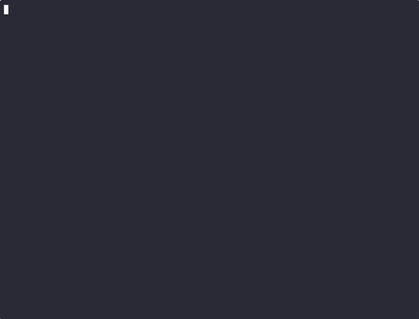

# Templates Deep Dive


- Helm uses the Go Programming Language's `text/template` and `html/template` packages/ Text templating engine to render templates.

- Anything within {{ and }} is a template action, which is part of the Go templating syntax.

## Template Actions

- One of the most basic and most used Helm Templating Syntax is actions.

- Action start and end with `{{` and `}}` respectively.

- Within these actions, we can use several other elements from the helm templating syntax, defining variables using conditional logic, if using loops invoking functions, and more.

- Whatever we have inside the `{{` and `}}` is rendered by the templating engine dynamically.

>[!NOTE]
>The `-` hyphen symbol is used in the begining of template to remove any trailing or leadin whitespaces.

- Let's start by playing around with `deployment.yaml` file.

  <details>
  <summary>deployment.yaml</summary><br>

  ```yaml
    apiVersion: apps/v1
    kind: Deployment
    {{"Helm Templating is " -}}, {{- "Cool"}}
    metadata:
    name: {{ include "test-chart.fullname" . }}
    labels:
        {{- include "test-chart.labels" . | nindent 4 }}
    spec:
    {{- if not .Values.autoscaling.enabled }}
    replicas: {{ .Values.replicaCount }}
    {{- end }}
    selector:
        matchLabels:
        {{- include "test-chart.selectorLabels" . | nindent 6 }}
    template:
        metadata:
        {{- with .Values.podAnnotations }}
        annotations:
            {{- toYaml . | nindent 8 }}
        {{- end }}
        labels:
            {{- include "test-chart.labels" . | nindent 8 }}
            {{- with .Values.podLabels }}
            {{- toYaml . | nindent 8 }}
            {{- end }}
        spec:
        {{- with .Values.imagePullSecrets }}
        imagePullSecrets:
            {{- toYaml . | nindent 8 }}
        {{- end }}
        serviceAccountName: {{ include "test-chart.serviceAccountName" . }}
        {{- with .Values.podSecurityContext }}
        securityContext:
            {{- toYaml . | nindent 8 }}
        {{- end }}
        containers:
            - name: {{ .Chart.Name }}
            {{- with .Values.securityContext }}
            securityContext:
                {{- toYaml . | nindent 12 }}
            {{- end }}
            image: "{{ .Values.image.repository }}:{{ .Values.image.tag | default .Chart.AppVersion }}"
            imagePullPolicy: {{ .Values.image.pullPolicy }}
            ports:
                - name: http
                containerPort: {{ .Values.service.port }}
                protocol: TCP
            {{- with .Values.livenessProbe }}
            livenessProbe:
                {{- toYaml . | nindent 12 }}
            {{- end }}
            {{- with .Values.readinessProbe }}
            readinessProbe:
                {{- toYaml . | nindent 12 }}
            {{- end }}
            {{- with .Values.resources }}
            resources:
                {{- toYaml . | nindent 12 }}
            {{- end }}
            {{- with .Values.volumeMounts }}
            volumeMounts:
                {{- toYaml . | nindent 12 }}
            {{- end }}
        {{- with .Values.volumes }}
        volumes:
            {{- toYaml . | nindent 8 }}
        {{- end }}
        {{- with .Values.nodeSelector }}
        nodeSelector:
            {{- toYaml . | nindent 8 }}
        {{- end }}
        {{- with .Values.affinity }}
        affinity:
            {{- toYaml . | nindent 8 }}
        {{- end }}
        {{- with .Values.tolerations }}
        tolerations:
            {{- toYaml . | nindent 8 }}
        {{- end }}
    ```

    </details>

  Run the command:

  ```bash
  helm template test-chart
  ```

  Now in the output, look for deployments section and there you would find something like this:

    ```yaml
    # Source: test-chart/templates/deployment.yaml
    apiVersion: apps/v1
    kind: Deployment
    Helm Templating is ,Cool
    metadata:
    name: release-name-test-chart
    labels:
        helm.sh/chart: test-chart-0.1.0
        app.kubernetes.io/name: test-chart
        app.kubernetes.io/instance: release-name
        app.kubernetes.io/version: "1.16.0"
        app.kubernetes.io/managed-by: Helm
    spec:
    replicas: 1
    ...
    ```

  And, here we can clearly see that the `{{"Helm Templating is " -}}, {{- "Cool"}}` is rendered as `Helm Templating is Cool`.

  All the unnecessary whitespaces are removed by using `-` hyphen symbol.

## Template Information

- When Helm renders a template, it passes all the information for the template as a single object represented by `.` (dot).

>[!IMPORTANT]
> The `.` (dot) is the root object that contains all the information about the template.
> It repesents all the information that a template can use, it has sub object likes values.
> <br/><br/>
> The sub-object values contains all the information from the `values.yaml` file.
> Values is a sub-object of the root object `.` (dot).

- We can also add our own custom values to the `values.yaml` file and use them in the template.

- For this example, as well let's take the `deployment.yaml` file.

    <details>
    <summary>deployment.yaml</summary><br>

    ```yaml
    apiVersion: apps/v1
    kind: Deployment
    {{.Values.my.custom.data }}
    metadata:
    name: {{ include "test-chart.fullname" . }}
    labels:
        {{- include "test-chart.labels" . | nindent 4 }}
    spec:
    {{- if not .Values.autoscaling.enabled }}
    replicas: {{ .Values.replicaCount }}
    {{- end }}
    selector:
        matchLabels:
        {{- include "test-chart.selectorLabels" . | nindent 6 }}
    template:
        metadata:
        {{- with .Values.podAnnotations }}
        annotations:
            {{- toYaml . | nindent 8 }}
        {{- end }}
        labels:
            {{- include "test-chart.labels" . | nindent 8 }}
            {{- with .Values.podLabels }}
            {{- toYaml . | nindent 8 }}
            {{- end }}
        spec:
        {{- with .Values.imagePullSecrets }}
        imagePullSecrets:
            {{- toYaml . | nindent 8 }}
        {{- end }}
        serviceAccountName: {{ include "test-chart.serviceAccountName" . }}
        {{- with .Values.podSecurityContext }}
        securityContext:
            {{- toYaml . | nindent 8 }}
        {{- end }}
        containers:
            - name: {{ .Chart.Name }}
            {{- with .Values.securityContext }}
            securityContext:
                {{- toYaml . | nindent 12 }}
            {{- end }}
            image: "{{ .Values.image.repository }}:{{ .Values.image.tag | default .Chart.AppVersion }}"
            imagePullPolicy: {{ .Values.image.pullPolicy }}
            ports:
                - name: http
                containerPort: {{ .Values.service.port }}
                protocol: TCP
            {{- with .Values.livenessProbe }}
            livenessProbe:
                {{- toYaml . | nindent 12 }}
            {{- end }}
            {{- with .Values.readinessProbe }}
            readinessProbe:
                {{- toYaml . | nindent 12 }}
            {{- end }}
            {{- with .Values.resources }}
            resources:
                {{- toYaml . | nindent 12 }}
            {{- end }}
            {{- with .Values.volumeMounts }}
            volumeMounts:
                {{- toYaml . | nindent 12 }}
            {{- end }}
        {{- with .Values.volumes }}
        volumes:
            {{- toYaml . | nindent 8 }}
        {{- end }}
        {{- with .Values.nodeSelector }}
        nodeSelector:
            {{- toYaml . | nindent 8 }}
        {{- end }}
        {{- with .Values.affinity }}
        affinity:
            {{- toYaml . | nindent 8 }}
        {{- end }}
        {{- with .Values.tolerations }}
        tolerations:
            {{- toYaml . | nindent 8 }}
        {{- end }}
    ```

    </details>

    Now, run the following command:

    ```bash
    helm template test-chart
    ```

    The output of the command `helm template test-chart` would be somethings like this:

    ```yaml
    ---
    # Source: test-chart/templates/deployment.yaml
    apiVersion: apps/v1
    kind: Deployment
      test
    metadata:
    name: release-name-test-chart
    labels:
        helm.sh/chart: test-chart-0.1.0
        app.kubernetes.io/name: test-chart
        app.kubernetes.io/instance: release-name
        app.kubernetes.io/version: "1.16.0"
        app.kubernetes.io/managed-by: Helm
    spec:
    replicas: 1
    ...
    ```

- The `.` (dot) object also has several other sub-objects if you want to access the chart information in one of your templates, we can do that using the Chart object.

  The code will look something like this:

  ```yaml
  {{.Chart.Version}}
  {{.Chart.Name}}
  {{.Chart.AppVersion}}
  {{.Chart.Annotations}}
  ```

  <details>
  <summary>deployment.yaml</summary><br>

    ```yaml
    apiVersion: apps/v1
    kind: Deployment
    {{.Values.my.custom.data }}
    {{.Chart.Version}}
    {{.Chart.Name}}
    {{.Chart.AppVersion}}
    {{.Chart.Annotations}}
    metadata:
    name: {{ include "test-chart.fullname" . }}
    labels:
        {{- include "test-chart.labels" . | nindent 4 }}
    spec:
    {{- if not .Values.autoscaling.enabled }}
    replicas: {{ .Values.replicaCount }}
    {{- end }}
    selector:
        matchLabels:
        {{- include "test-chart.selectorLabels" . | nindent 6 }}
    template:
        metadata:
        {{- with .Values.podAnnotations }}
        annotations:
            {{- toYaml . | nindent 8 }}
        {{- end }}
        labels:
            {{- include "test-chart.labels" . | nindent 8 }}
            {{- with .Values.podLabels }}
            {{- toYaml . | nindent 8 }}
            {{- end }}
        spec:
        {{- with .Values.imagePullSecrets }}
        imagePullSecrets:
            {{- toYaml . | nindent 8 }}
        {{- end }}
        serviceAccountName: {{ include "test-chart.serviceAccountName" . }}
        {{- with .Values.podSecurityContext }}
        securityContext:
            {{- toYaml . | nindent 8 }}
        {{- end }}
        containers:
            - name: {{ .Chart.Name }}
            {{- with .Values.securityContext }}
            securityContext:
                {{- toYaml . | nindent 12 }}
            {{- end }}
            image: "{{ .Values.image.repository }}:{{ .Values.image.tag | default .Chart.AppVersion }}"
            imagePullPolicy: {{ .Values.image.pullPolicy }}
            ports:
                - name: http
                containerPort: {{ .Values.service.port }}
                protocol: TCP
            {{- with .Values.livenessProbe }}
            livenessProbe:
                {{- toYaml . | nindent 12 }}
            {{- end }}
            {{- with .Values.readinessProbe }}
            readinessProbe:
                {{- toYaml . | nindent 12 }}
            {{- end }}
            {{- with .Values.resources }}
            resources:
                {{- toYaml . | nindent 12 }}
            {{- end }}
            {{- with .Values.volumeMounts }}
            volumeMounts:
                {{- toYaml . | nindent 12 }}
            {{- end }}
        {{- with .Values.volumes }}
        volumes:
            {{- toYaml . | nindent 8 }}
        {{- end }}
        {{- with .Values.nodeSelector }}
        nodeSelector:
            {{- toYaml . | nindent 8 }}
        {{- end }}
        {{- with .Values.affinity }}
        affinity:
            {{- toYaml . | nindent 8 }}
        {{- end }}
        {{- with .Values.tolerations }}
        tolerations:
            {{- toYaml . | nindent 8 }}
        {{- end }}
    ```

    </details>

    Now, run the following command:

    ```bash
    helm template test-chart
    ```

    The output of the command `helm template test-chart` would be somethings like this:

    ```yaml
    ---
    # Source: test-chart/templates/deployment.yaml
    apiVersion: apps/v1
    kind: Deployment
    test
    0.1.0
    test-chart
    1.16.0
    map[]
    ```

- Another important object that we can use is the Release object.

  The release object contains information about the release, such as the release name, namespace, and the release timestamp.

  The code will look something like this:

  ```yaml
  {{.Release.Name}}
  {{.Release.Namespace}}
  {{.Release.IsUpgrade}}
  {{.Release.IsInstall}}
  {{.Release.Revision}}
  {{.Release.Service}}
  {{.Release.Chart}}
  {{.Release.Config}}
  {{.Release.Manifest}}
  ```

  <details>
  <summary>deployment.yaml</summary><br>

    ```yaml
    apiVersion: apps/v1
    kind: Deployment
    {{.Values.my.custom.data }}
    {{.Chart.Version}}
    {{.Chart.Name}}
    {{.Chart.AppVersion}}
    {{.Chart.Annotations}}
    {{.Release.Name}}
    {{.Release.IsUpgrade}}
    {{.Release.IsInstall}}
    {{.Release.Service}}
    metadata:
    name: {{ include "test-chart.fullname" . }}
    labels:
        {{- include "test-chart.labels" . | nindent 4 }}
    spec:
    {{- if not .Values.autoscaling.enabled }}
    replicas: {{ .Values.replicaCount }}
    {{- end }}
    selector:
        matchLabels:
        {{- include "test-chart.selectorLabels" . | nindent 6 }}
    template:
        metadata:
        {{- with .Values.podAnnotations }}
        annotations:
            {{- toYaml . | nindent 8 }}
        {{- end }}
        labels:
            {{- include "test-chart.labels" . | nindent 8 }}
            {{- with .Values.podLabels }}
            {{- toYaml . | nindent 8 }}
            {{- end }}
        spec:
        {{- with .Values.imagePullSecrets }}
        imagePullSecrets:
            {{- toYaml . | nindent 8 }}
        {{- end }}
        serviceAccountName: {{ include "test-chart.serviceAccountName" . }}
        {{- with .Values.podSecurityContext }}
        securityContext:
            {{- toYaml . | nindent 8 }}
        {{- end }}
        containers:
            - name: {{ .Chart.Name }}
            {{- with .Values.securityContext }}
            securityContext:
                {{- toYaml . | nindent 12 }}
            {{- end }}
            image: "{{ .Values.image.repository }}:{{ .Values.image.tag | default .Chart.AppVersion }}"
            imagePullPolicy: {{ .Values.image.pullPolicy }}
            ports:
                - name: http
                containerPort: {{ .Values.service.port }}
                protocol: TCP
            {{- with .Values.livenessProbe }}
            livenessProbe:
                {{- toYaml . | nindent 12 }}
            {{- end }}
            {{- with .Values.readinessProbe }}
            readinessProbe:
                {{- toYaml . | nindent 12 }}
            {{- end }}
            {{- with .Values.resources }}
            resources:
                {{- toYaml . | nindent 12 }}
            {{- end }}
            {{- with .Values.volumeMounts }}
            volumeMounts:
                {{- toYaml . | nindent 12 }}
            {{- end }}
        {{- with .Values.volumes }}
        volumes:
            {{- toYaml . | nindent 8 }}
        {{- end }}
        {{- with .Values.nodeSelector }}
        nodeSelector:
            {{- toYaml . | nindent 8 }}
        {{- end }}
        {{- with .Values.affinity }}
        affinity:
            {{- toYaml . | nindent 8 }}
        {{- end }}
        {{- with .Values.tolerations }}
        tolerations:
            {{- toYaml . | nindent 8 }}
        {{- end }}
    ```

- Now, run the following command:

  ```bash
  helm template test-chart
  ```

  The output of the command `helm template test-chart` would be somethings like this:

    ```yaml
    ---
    selector:
    app.kubernetes.io/name: test-chart
    app.kubernetes.io/instance: release-name
    ---
    # Source: test-chart/templates/deployment.yaml
    apiVersion: apps/v1
    kind: Deployment
    test
    0.1.0
    test-chart
    1.16.0
    map[]
    release-name
    false
    true
    Helm
    metadata:
    name: release-name-test-chart
    labels:
        helm.sh/chart: test-chart-0.1.0
        app.kubernetes.io/name: test-chart
        app.kubernetes.io/instance: release-name
    ...
    ```

- We also have another important one `Template`, which contains information about the template itself.

  The code will look something like this:

  ```yaml
  {{.Template.Name}}
  {{.Template.BasePath}}
  {{.Template.Path}}
  ```

  <details>
  <summary>deployment.yaml</summary><br>

    ```yaml
    apiVersion: apps/v1
    kind: Deployment
        {{.Values.my.custom.data }}
        {{.Chart.Version}}
        {{.Chart.Name}}
        {{.Chart.AppVersion}}
        {{.Chart.Annotations}}
        {{.Release.Name}}
        {{.Release.IsUpgrade}}
        {{.Release.IsInstall}}
        {{.Release.Service}}
        {{.Template.Name}}
        {{.Template.BasePath}}
    metadata:
    name: {{ include "test-chart.fullname" . }}
    labels:
        {{- include "test-chart.labels" . | nindent 4 }}
    spec:
    {{- if not .Values.autoscaling.enabled }}
    replicas: {{ .Values.replicaCount }}
    {{- end }}
    selector:
        matchLabels:
        {{- include "test-chart.selectorLabels" . | nindent 6 }}
    template:
        metadata:
        {{- with .Values.podAnnotations }}
        annotations:
            {{- toYaml . | nindent 8 }}
        {{- end }}
        labels:
            {{- include "test-chart.labels" . | nindent 8 }}
            {{- with .Values.podLabels }}
            {{- toYaml . | nindent 8 }}
            {{- end }}
        spec:
        {{- with .Values.imagePullSecrets }}
        imagePullSecrets:
            {{- toYaml . | nindent 8 }}
        {{- end }}
        serviceAccountName: {{ include "test-chart.serviceAccountName" . }}
        {{- with .Values.podSecurityContext }}
        securityContext:
            {{- toYaml . | nindent 8 }}
        {{- end }}
        containers:
            - name: {{ .Chart.Name }}
            {{- with .Values.securityContext }}
            securityContext:
                {{- toYaml . | nindent 12 }}
            {{- end }}
            image: "{{ .Values.image.repository }}:{{ .Values.image.tag | default .Chart.AppVersion }}"
            imagePullPolicy: {{ .Values.image.pullPolicy }}
            ports:
                - name: http
                containerPort: {{ .Values.service.port }}
                protocol: TCP
            {{- with .Values.livenessProbe }}
            livenessProbe:
                {{- toYaml . | nindent 12 }}
            {{- end }}
            {{- with .Values.readinessProbe }}
            readinessProbe:
                {{- toYaml . | nindent 12 }}
            {{- end }}
            {{- with .Values.resources }}
            resources:
                {{- toYaml . | nindent 12 }}
            {{- end }}
            {{- with .Values.volumeMounts }}
            volumeMounts:
                {{- toYaml . | nindent 12 }}
            {{- end }}
        {{- with .Values.volumes }}
        volumes:
            {{- toYaml . | nindent 8 }}
        {{- end }}
        {{- with .Values.nodeSelector }}
        nodeSelector:
            {{- toYaml . | nindent 8 }}
        {{- end }}
        {{- with .Values.affinity }}
        affinity:
            {{- toYaml . | nindent 8 }}
        {{- end }}
        {{- with .Values.tolerations }}
        tolerations:
            {{- toYaml . | nindent 8 }}
        {{- end }} 
    ```

    </details>

    Now, run the following command:

    ```bash
    helm template test-chart
    ```

    The output of the command `helm template test-chart` would be somethings like this:

    ```yaml
      selector:
        app.kubernetes.io/name: test-chart
        app.kubernetes.io/instance: release-name
    ---
    # Source: test-chart/templates/deployment.yaml
    apiVersion: apps/v1
    kind: Deployment
    test
    0.1.0
    test-chart
    1.16.0
    map[]
    release-name
    false
    true
    Helm
    test-chart/templates/deployment.yaml
    test-chart/templates
    metadata:
    name: release-name-test-chart
    labels:
        helm.sh/chart: test-chart-0.1.0
        app.kubernetes.io/name: test-chart
        app.kubernetes.io/instance: release-name
        app.kubernetes.io/version: "1.16.0"
        app.kubernetes.io/managed-by: Helm
    ...
    ```

## Pipe `|`

- If you go under the metadata section under labels we will see pipe `|` symbol. Not, only that the pipe allows us to chain  multiple expressions, commands or  function calls.

  The output of function on the left side of the pipe will be passed as an input to the function on the right side of the pipe.

  ```yaml
  {{ .Values.my.custom.data | default "testdefault" | upper | quote }}
  ```

  <details>
  <summary>deployment.yaml</summary><br>
    
    ```yaml
    apiVersion: apps/v1
    kind: Deployment
    {{.Values.my.custom.data }}
    {{.Chart.Version}}
    {{.Chart.Name}}
    {{.Chart.AppVersion}}
    {{.Chart.Annotations}}
    {{.Release.Name}}
    {{.Release.IsUpgrade}}
    {{.Release.IsInstall}}
    {{.Release.Service}}
    {{.Template.Name}}
    {{.Template.BasePath}}
    {{ .Values.my.custom.data | default "testdefault" | upper | quote }}
    metadata:
    name: {{ include "test-chart.fullname" . }}
    labels:
        {{- include "test-chart.labels" . | nindent 4 }}
    spec:
    {{- if not .Values.autoscaling.enabled }}
    replicas: {{ .Values.replicaCount }}
    {{- end }}
    selector:
        matchLabels:
        {{- include "test-chart.selectorLabels" . | nindent 6 }}
    template:
        metadata:
        {{- with .Values.podAnnotations }}
        annotations:
            {{- toYaml . | nindent 8 }}
        {{- end }}
        labels:
            {{- include "test-chart.labels" . | nindent 8 }}
            {{- with .Values.podLabels }}
            {{- toYaml . | nindent 8 }}
            {{- end }}
        spec:
        {{- with .Values.imagePullSecrets }}
        imagePullSecrets:
            {{- toYaml . | nindent 8 }}
        {{- end }}
        serviceAccountName: {{ include "test-chart.serviceAccountName" . }}
        {{- with .Values.podSecurityContext }}
        securityContext:
            {{- toYaml . | nindent 8 }}
        {{- end }}
        containers:
            - name: {{ .Chart.Name }}
            {{- with .Values.securityContext }}
            securityContext:
                {{- toYaml . | nindent 12 }}
            {{- end }}
            image: "{{ .Values.image.repository }}:{{ .Values.image.tag | default .Chart.AppVersion }}"
            imagePullPolicy: {{ .Values.image.pullPolicy }}
            ports:
                - name: http
                containerPort: {{ .Values.service.port }}
                protocol: TCP
            {{- with .Values.livenessProbe }}
            livenessProbe:
                {{- toYaml . | nindent 12 }}
            {{- end }}
            {{- with .Values.readinessProbe }}
            readinessProbe:
                {{- toYaml . | nindent 12 }}
            {{- end }}
            {{- with .Values.resources }}
            resources:
                {{- toYaml . | nindent 12 }}
            {{- end }}
            {{- with .Values.volumeMounts }}
            volumeMounts:
                {{- toYaml . | nindent 12 }}
            {{- end }}
        {{- with .Values.volumes }}
        volumes:
            {{- toYaml . | nindent 8 }}
        {{- end }}
        {{- with .Values.nodeSelector }}
        nodeSelector:
            {{- toYaml . | nindent 8 }}
        {{- end }}
        {{- with .Values.affinity }}
        affinity:
            {{- toYaml . | nindent 8 }}
        {{- end }}
        {{- with .Values.tolerations }}
        tolerations:
            {{- toYaml . | nindent 8 }}
        {{- end }}
    ```

    </details>

    Now, run the following command:

    ```bash
    $ helm template test-chart
    ```

    Once done, the output of the command `helm template test-chart` would be somethings like this:

    ```yaml
        app.kubernetes.io/name: test-chart
    app.kubernetes.io/instance: release-name
    ---
    # Source: test-chart/templates/deployment.yaml
    apiVersion: apps/v1
    kind: Deployment
    test
    0.1.0
    test-chart
    1.16.0
    map[]
    release-name
    false
    true
    Helm
    test-chart/templates/deployment.yaml
    test-chart/templates
    "TEST"
    metadata:
    name: release-name-test-chart
    labels:
        helm.sh/chart: test-chart-0.1.0
        app.kubernetes.io/name: test-chart
    ...
    ```

## Function

- Helm gives us various template functions that can be used to transform data within our template. We have already seen some of these functions like `default` , `upper`, `quote`, `nindent` etc...
- Functions are used to manipulate the data within the template. We can pass data/arguments to the function, and based on that it will render the yaml files.
- Similarly, with `toYaml` function when we get the data from values files or chart files, wtc.. we get it as objects. This 2 YAML will convert the current object into YAML, so that it can be pushed into the output as YAML.

## Conditional Logic in Helm

- So, to understand this let's try it out with an example:
- Add the following to your `values.yam` file:

  ```yaml
  my:
    custom:
      data: "test"
      flag: true
  ```
  
- Once added, let's make changes to `deployment.yaml` file now:

  ```yaml
  apiVersion: apps/v1
  kind: Deployment
    {{.Values.my.custom.data }}
    {{.Chart.Version}}
    {{.Chart.Name}}
    {{.Chart.AppVersion}}
    {{.Chart.Annotations}}
    {{.Release.Name}}
    {{.Release.IsUpgrade}}
    {{.Release.IsInstall}}
    {{.Release.Service}}
    {{.Template.Name}}
    {{.Template.BasePath}}
    {{ .Values.my.custom.data | default "testdefault" | upper | quote }}
    
  {{- if .Values.my.custom.flag }}
  {{ "Output of if condition" | nindent 2 }}
  {{- end }}
  metadata:
    name: {{ include "test-chart.fullname" . }}
    labels:
      {{- include "test-chart.labels" . | nindent 4 }}
  spec:
    {{- if not .Values.autoscaling.enabled }}
    replicas: {{ .Values.replicaCount }}
    {{- end }}
    selector:
      matchLabels:
        {{- include "test-chart.selectorLabels" . | nindent 6 }}
    template:
      metadata:
        {{- with .Values.podAnnotations }}
        annotations:
          {{- toYaml . | nindent 8 }}
        {{- end }}
        labels:
          {{- include "test-chart.labels" . | nindent 8 }}
          {{- with .Values.podLabels }}
          {{- toYaml . | nindent 8 }}
          {{- end }}
      spec:
        {{- with .Values.imagePullSecrets }}
        imagePullSecrets:
          {{- toYaml . | nindent 8 }}
        {{- end }}
        serviceAccountName: {{ include "test-chart.serviceAccountName" . }}
        {{- with .Values.podSecurityContext }}
        securityContext:
          {{- toYaml . | nindent 8 }}
        {{- end }}
        containers:
          - name: {{ .Chart.Name }}
            {{- with .Values.securityContext }}
            securityContext:
              {{- toYaml . | nindent 12 }}
            {{- end }}
            image: "{{ .Values.image.repository }}:{{ .Values.image.tag | default .Chart.AppVersion }}"
            imagePullPolicy: {{ .Values.image.pullPolicy }}
            ports:
              - name: http
                containerPort: {{ .Values.service.port }}
                protocol: TCP
            {{- with .Values.livenessProbe }}
            livenessProbe:
              {{- toYaml . | nindent 12 }}
            {{- end }}
            {{- with .Values.readinessProbe }}
            readinessProbe:
              {{- toYaml . | nindent 12 }}
            {{- end }}
            {{- with .Values.resources }}
            resources:
              {{- toYaml . | nindent 12 }}
            {{- end }}
            {{- with .Values.volumeMounts }}
            volumeMounts:
              {{- toYaml . | nindent 12 }}
            {{- end }}
        {{- with .Values.volumes }}
        volumes:
          {{- toYaml . | nindent 8 }}
        {{- end }}
        {{- with .Values.nodeSelector }}
        nodeSelector:
          {{- toYaml . | nindent 8 }}
        {{- end }}
        {{- with .Values.affinity }}
        affinity:
          {{- toYaml . | nindent 8 }}
        {{- end }}
        {{- with .Values.tolerations }}
        tolerations:
          {{- toYaml . | nindent 8 }}
        {{- end }}
  
  ```
  
- Once done, let's see how the changes comes up.

  

  Here's the output:
  
  ```yaml
  ---
  # Source: test-chart/templates/serviceaccount.yaml
  apiVersion: v1
  kind: ServiceAccount
  metadata:
    name: release-name-test-chart
    labels:
      helm.sh/chart: test-chart-0.1.0
      app.kubernetes.io/name: test-chart
      app.kubernetes.io/instance: release-name
      app.kubernetes.io/version: "1.16.0"
      app.kubernetes.io/managed-by: Helm
  automountServiceAccountToken: true
  ---
  # Source: test-chart/templates/service.yaml
  apiVersion: v1
  kind: Service
  metadata:
    name: release-name-test-chart
    labels:
      helm.sh/chart: test-chart-0.1.0
      app.kubernetes.io/name: test-chart
      app.kubernetes.io/instance: release-name
      app.kubernetes.io/version: "1.16.0"
      app.kubernetes.io/managed-by: Helm
  spec:
    type: ClusterIP
    ports:
      - port: 80
        targetPort: http
        protocol: TCP
        name: http
    selector:
      app.kubernetes.io/name: test-chart
      app.kubernetes.io/instance: release-name
  ---
  # Source: test-chart/templates/deployment.yaml
  apiVersion: apps/v1
  kind: Deployment
    test
    0.1.0
    test-chart
    1.16.0
    map[]
    release-name
    false
    true
    Helm
    test-chart/templates/deployment.yaml
    test-chart/templates
    "TEST"
  
    Output of if condition
  metadata:
    name: release-name-test-chart
    labels:
      helm.sh/chart: test-chart-0.1.0
      app.kubernetes.io/name: test-chart
      app.kubernetes.io/instance: release-name
      app.kubernetes.io/version: "1.16.0"
      app.kubernetes.io/managed-by: Helm
  spec:
    replicas: 1
    selector:
      matchLabels:
        app.kubernetes.io/name: test-chart
        app.kubernetes.io/instance: release-name
    template:
      metadata:
        labels:
          helm.sh/chart: test-chart-0.1.0
          app.kubernetes.io/name: test-chart
          app.kubernetes.io/instance: release-name
          app.kubernetes.io/version: "1.16.0"
          app.kubernetes.io/managed-by: Helm
      spec:
        serviceAccountName: release-name-test-chart
        containers:
          - name: test-chart
            image: "nginx:1.16.0"
            imagePullPolicy: IfNotPresent
            ports:
              - name: http
                containerPort: 80
                protocol: TCP
            livenessProbe:
              httpGet:
                path: /
                port: http
            readinessProbe:
              httpGet:
                path: /
                port: http
  ---
  # Source: test-chart/templates/tests/test-connection.yaml
  apiVersion: v1
  kind: Pod
  metadata:
    name: "release-name-test-chart-test-connection"
    labels:
      helm.sh/chart: test-chart-0.1.0
      app.kubernetes.io/name: test-chart
      app.kubernetes.io/instance: release-name
      app.kubernetes.io/version: "1.16.0"
      app.kubernetes.io/managed-by: Helm
    annotations:
      "helm.sh/hook": test
  spec:
    containers:
      - name: wget
        image: busybox
        command: ['wget']
        args: ['release-name-test-chart:80']
    restartPolicy: Never
  ```
  
- If you set the same flag to false, this line won't show up in the output, as now the condition is false.
- We can also have a `else` condition in the template, which will be executed if the `if` condition is false.

  ```yaml
  {{- if .Values.my.custom.flag }}
  {{ "Output of if condition" | nindent 2 }}
  {{- else }}
  {{ "Output of else condition" | nindent 2 }}
  {{- end }}
  ```
  
- So, now when you will re-execute it, with the `flag` value being false, the output of the else condition will show up.

## Using `with`

- `with` is used to change the context of the template. It allows us to change the context of the template to a different object.
- This is useful when we want to access the properties of an object without having to use the `.` (dot) notation every time.
- Let's try to understand this with an example. Let's start by making changes in `values.yaml`

  ```yaml
  # Update our custom data in values.yaml
  my:
    custom:
      data: "test"
      flag: true
      region:
        - US
        - Pacific
        - EMEA
        - China
  ```

- Now, let's make changes to `deployment.yaml` file now:


  ```yaml
  apiVersion: apps/v1
  kind: Deployment
    {{.Values.my.custom.data }}
    {{.Chart.Version}}
    {{.Chart.Name}}
    {{.Chart.AppVersion}}
    {{.Chart.Annotations}}
    {{.Release.Name}}
    {{.Release.IsUpgrade}}
    {{.Release.IsInstall}}
    {{.Release.Service}}
    {{.Template.Name}}
    {{.Template.BasePath}}
    {{ .Values.my.custom.data | default "testdefault" | upper | quote }}

    {{- if .Values.my.custom.flag }}
    {{ "Output of if condition" | nindent 2 }}
    {{- end }}

  metadata:
    name: {{ include "test-chart.fullname" . }}
    region:
            {{- with .Values.my.custom.region }}
                    # If variable over here is empty it won't be part of the output
                    {{- toYaml . | nindent 4 }}
                    {{ end }}
    labels:
            {{- include "test-chart.labels" . | nindent 4 }}
  spec:
          {{- if not .Values.autoscaling.enabled }}
    replicas: {{ .Values.replicaCount }}
          {{- end }}
    selector:
      matchLabels:
              {{- include "test-chart.selectorLabels" . | nindent 6 }}
    template:
      metadata:
              {{- with .Values.podAnnotations }}
        annotations:
                {{- toYaml . | nindent 8 }}
              {{- end }}
        labels:
                {{- include "test-chart.labels" . | nindent 8 }}
                        {{- with .Values.podLabels }}
                        {{- toYaml . | nindent 8 }}
                        {{- end }}
      spec:
              {{- with .Values.imagePullSecrets }}
        imagePullSecrets:
                {{- toYaml . | nindent 8 }}
              {{- end }}
        serviceAccountName: {{ include "test-chart.serviceAccountName" . }}
              {{- with .Values.podSecurityContext }}
        securityContext:
                {{- toYaml . | nindent 8 }}
              {{- end }}
        containers:
          - name: {{ .Chart.Name }}
                  {{- with .Values.securityContext }}
            securityContext:
                    {{- toYaml . | nindent 12 }}
                  {{- end }}
            image: "{{ .Values.image.repository }}:{{ .Values.image.tag | default .Chart.AppVersion }}"
            imagePullPolicy: {{ .Values.image.pullPolicy }}
            ports:
              - name: http
                containerPort: {{ .Values.service.port }}
                protocol: TCP
                  {{- with .Values.livenessProbe }}
            livenessProbe:
                    {{- toYaml . | nindent 12 }}
                  {{- end }}
                  {{- with .Values.readinessProbe }}
            readinessProbe:
                    {{- toYaml . | nindent 12 }}
                  {{- end }}
                  {{- with .Values.resources }}
            resources:
                    {{- toYaml . | nindent 12 }}
                  {{- end }}
                  {{- with .Values.volumeMounts }}
            volumeMounts:
                    {{- toYaml . | nindent 12 }}
                  {{- end }}
              {{- with .Values.volumes }}
        volumes:
                {{- toYaml . | nindent 8 }}
              {{- end }}
              {{- with .Values.nodeSelector }}
        nodeSelector:
                {{- toYaml . | nindent 8 }}
              {{- end }}
              {{- with .Values.affinity }}
        affinity:
                {{- toYaml . | nindent 8 }}
              {{- end }}
              {{- with .Values.tolerations }}
        tolerations:
                {{- toYaml . | nindent 8 }}
              {{- end }}

  ```

- Let's try to understand what it means actually:

  ```yaml
  region:
    {{- with .Values.my.custom.region }}
    # If variable over here is empty it won't be part of the output
    {{- toYaml . | nindent 4 }}
    {{ end }}
  ```
  
- So, `with` is not same as `if`. `with` only works when the variable has some value. We can than use the `toYaml` function that will take the data from `values.yaml` as an object. So the `.` here, doesn't point to the root anymore, the scope will be the current element.
- If, you want to use `.Values` and naviagate within the `if` block, you can use a special symbol called `$`.

> [!IMPORTANT]
> In `with`, `$.` again points to the root. And, the `.` only points to the current element.

- Now, once we have made the changes use the command `helm template test-chart`, and view the output:

  ```yaml
  ---
  # Source: test-chart/templates/serviceaccount.yaml
  apiVersion: v1
  kind: ServiceAccount
  metadata:
    name: release-name-test-chart
    labels:
      helm.sh/chart: test-chart-0.1.0
      app.kubernetes.io/name: test-chart
      app.kubernetes.io/instance: release-name
      app.kubernetes.io/version: "1.16.0"
      app.kubernetes.io/managed-by: Helm
  automountServiceAccountToken: true
  ---
  # Source: test-chart/templates/service.yaml
  apiVersion: v1
  kind: Service
  metadata:
    name: release-name-test-chart
    labels:
      helm.sh/chart: test-chart-0.1.0
      app.kubernetes.io/name: test-chart
      app.kubernetes.io/instance: release-name
      app.kubernetes.io/version: "1.16.0"
      app.kubernetes.io/managed-by: Helm
  spec:
    type: ClusterIP
    ports:
      - port: 80
        targetPort: http
        protocol: TCP
        name: http
    selector:
      app.kubernetes.io/name: test-chart
      app.kubernetes.io/instance: release-name
  ---
  # Source: test-chart/templates/deployment.yaml
  apiVersion: apps/v1
  kind: Deployment
    test
    0.1.0
    test-chart
    1.16.0
    map[]
    release-name
    false
    true
    Helm
    test-chart/templates/deployment.yaml
    test-chart/templates
    "TEST"
  
    Output of if condition
  
  metadata:
    name: release-name-test-chart
    region:
        # If variable over here is empty it won't be part of the output
      - US
      - Pacific
      - EMEA
      - China
  
    labels:
      helm.sh/chart: test-chart-0.1.0
      app.kubernetes.io/name: test-chart
      app.kubernetes.io/instance: release-name
      app.kubernetes.io/version: "1.16.0"
      app.kubernetes.io/managed-by: Helm
  spec:
    replicas: 1
    selector:
      matchLabels:
        app.kubernetes.io/name: test-chart
        app.kubernetes.io/instance: release-name
    template:
      metadata:
        labels:
          helm.sh/chart: test-chart-0.1.0
          app.kubernetes.io/name: test-chart
          app.kubernetes.io/instance: release-name
          app.kubernetes.io/version: "1.16.0"
          app.kubernetes.io/managed-by: Helm
      spec:
        serviceAccountName: release-name-test-chart
        containers:
          - name: test-chart
            image: "nginx:1.16.0"
            imagePullPolicy: IfNotPresent
            ports:
              - name: http
                containerPort: 80
                protocol: TCP
            livenessProbe:
              httpGet:
                path: /
                port: http
            readinessProbe:
              httpGet:
                path: /
                port: http
  ---
  # Source: test-chart/templates/tests/test-connection.yaml
  apiVersion: v1
  kind: Pod
  metadata:
    name: "release-name-test-chart-test-connection"
    labels:
      helm.sh/chart: test-chart-0.1.0
      app.kubernetes.io/name: test-chart
      app.kubernetes.io/instance: release-name
      app.kubernetes.io/version: "1.16.0"
      app.kubernetes.io/managed-by: Helm
    annotations:
      "helm.sh/hook": test
  spec:
    containers:
      - name: wget
        image: busybox
        command: ['wget']
        args: ['release-name-test-chart:80']
    restartPolicy: Never
  ```
  
- As, you can see herein the output, now we see the regions that we mentioned in the `values.yaml` file. But, if we were to leave the values empty, it won't render them.

- We can also add an else condition here, similar to if-else, in the following manner:

  ```yaml
  region:
      {{- with .Values.my.custom.region }}
      # If variable over here is empty it won't be part of the output
      {{- toYaml . | nindent 4 }}
      {{- else }}
      {{ "- Pacific"}}
      {{ end }}
  ```

# Defining Variables

- Defining a variable in helm is pretty easy, let's look at an example on how to define a variable.

  ```yaml
  {{ $myFLAG := "value" }}  
  ```
  
- Once, we assign value to a variable, it becomes a variable of that type.

>[!NOTE]
> If you try to assign different values to this variable at later point in the helm chart template, those will just be ignored. They will not be considered and, only the initial value will be used.

- Let's test this out with an example. For this we will be only making changes to  `deployment.yaml` file only.


  `deployment.yaml`
  
  
  ```yaml
  apiVersion: apps/v1
  kind: Deployment
    {{.Values.my.custom.data }}
    {{.Chart.Version}}
    {{.Chart.Name}}
    {{.Chart.AppVersion}}
    {{.Chart.Annotations}}
    {{.Release.Name}}
    {{.Release.IsUpgrade}}
    {{.Release.IsInstall}}
    {{.Release.Service}}
    {{.Template.Name}}
    {{.Template.BasePath}}
    {{ .Values.my.custom.data | default "testdefault" | upper | quote }}

    {{ $myFLAG := .Values.my.custom.flag }}

    {{- if $myFLAG }}
    {{ "Output of if condition" | nindent 2 }}
    {{- end }}

  metadata:
    name: {{ include "test-chart.fullname" . }}
    region:
            {{- with .Values.my.custom.region }}
                    # If variable over here is empty it won't be part of the output
                    {{- toYaml . | nindent 4 }}
                    {{- else }}
                    {{ "- Pacific"}}
                    {{ end }}
    labels:
            {{- include "test-chart.labels" . | nindent 4 }}
  spec:
          {{- if not .Values.autoscaling.enabled }}
    replicas: {{ .Values.replicaCount }}
          {{- end }}
    selector:
      matchLabels:
              {{- include "test-chart.selectorLabels" . | nindent 6 }}
    template:
      metadata:
              {{- with .Values.podAnnotations }}
        annotations:
                {{- toYaml . | nindent 8 }}
              {{- end }}
        labels:
                {{- include "test-chart.labels" . | nindent 8 }}
                        {{- with .Values.podLabels }}
                        {{- toYaml . | nindent 8 }}
                        {{- end }}
      spec:
              {{- with .Values.imagePullSecrets }}
        imagePullSecrets:
                {{- toYaml . | nindent 8 }}
              {{- end }}
        serviceAccountName: {{ include "test-chart.serviceAccountName" . }}
              {{- with .Values.podSecurityContext }}
        securityContext:
                {{- toYaml . | nindent 8 }}
              {{- end }}
        containers:
          - name: {{ .Chart.Name }}
                  {{- with .Values.securityContext }}
            securityContext:
                    {{- toYaml . | nindent 12 }}
                  {{- end }}
            image: "{{ .Values.image.repository }}:{{ .Values.image.tag | default .Chart.AppVersion }}"
            imagePullPolicy: {{ .Values.image.pullPolicy }}
            ports:
              - name: http
                containerPort: {{ .Values.service.port }}
                protocol: TCP
                  {{- with .Values.livenessProbe }}
            livenessProbe:
                    {{- toYaml . | nindent 12 }}
                  {{- end }}
                  {{- with .Values.readinessProbe }}
            readinessProbe:
                    {{- toYaml . | nindent 12 }}
                  {{- end }}
                  {{- with .Values.resources }}
            resources:
                    {{- toYaml . | nindent 12 }}
                  {{- end }}
                  {{- with .Values.volumeMounts }}
            volumeMounts:
                    {{- toYaml . | nindent 12 }}
                  {{- end }}
              {{- with .Values.volumes }}
        volumes:
                {{- toYaml . | nindent 8 }}
              {{- end }}
              {{- with .Values.nodeSelector }}
        nodeSelector:
                {{- toYaml . | nindent 8 }}
              {{- end }}
              {{- with .Values.affinity }}
        affinity:
                {{- toYaml . | nindent 8 }}
              {{- end }}
              {{- with .Values.tolerations }}
        tolerations:
                {{- toYaml . | nindent 8 }}
              {{- end }}

  ```

- Here, you can clearly see that, how we have utilised variables.

  ```yaml
  {{ $myFLAG := .Values.my.custom.flag }}
  
      {{- if $myFLAG }}
      {{ "Output of if condition" | nindent 2 }}
      {{- end }}
  ```

- If you run the command `helm template test-chart`, you will see the following output:

  ```yaml
      ~/G/helm-tutorial/e/test-chart  on   main !2  helm template test-chart
  ---
  # Source: test-chart/templates/serviceaccount.yaml
  apiVersion: v1
  kind: ServiceAccount
  metadata:
    name: release-name-test-chart
    labels:
      helm.sh/chart: test-chart-0.1.0
      app.kubernetes.io/name: test-chart
      app.kubernetes.io/instance: release-name
      app.kubernetes.io/version: "1.16.0"
      app.kubernetes.io/managed-by: Helm
  automountServiceAccountToken: true
  ---
  # Source: test-chart/templates/service.yaml
  apiVersion: v1
  kind: Service
  metadata:
    name: release-name-test-chart
    labels:
      helm.sh/chart: test-chart-0.1.0
      app.kubernetes.io/name: test-chart
      app.kubernetes.io/instance: release-name
      app.kubernetes.io/version: "1.16.0"
      app.kubernetes.io/managed-by: Helm
  spec:
    type: ClusterIP
    ports:
      - port: 80
        targetPort: http
        protocol: TCP
        name: http
    selector:
      app.kubernetes.io/name: test-chart
      app.kubernetes.io/instance: release-name
  ---
  # Source: test-chart/templates/deployment.yaml
  apiVersion: apps/v1
  kind: Deployment
    test
    0.1.0
    test-chart
    1.16.0
    map[]
    release-name
    false
    true
    Helm
    test-chart/templates/deployment.yaml
    test-chart/templates
    "TEST"
  
  
  
    Output of if condition
  
  metadata:
    name: release-name-test-chart
    region:
        # If variable over here is empty it won't be part of the output
      - US
      - Pacific
      - EMEA
      - China
    labels:
      helm.sh/chart: test-chart-0.1.0
      app.kubernetes.io/name: test-chart
      app.kubernetes.io/instance: release-name
      app.kubernetes.io/version: "1.16.0"
      app.kubernetes.io/managed-by: Helm
  spec:
    replicas: 1
    selector:
      matchLabels:
        app.kubernetes.io/name: test-chart
        app.kubernetes.io/instance: release-name
    template:
      metadata:
        labels:
          helm.sh/chart: test-chart-0.1.0
          app.kubernetes.io/name: test-chart
          app.kubernetes.io/instance: release-name
          app.kubernetes.io/version: "1.16.0"
          app.kubernetes.io/managed-by: Helm
      spec:
        serviceAccountName: release-name-test-chart
        containers:
          - name: test-chart
            image: "nginx:1.16.0"
            imagePullPolicy: IfNotPresent
            ports:
              - name: http
                containerPort: 80
                protocol: TCP
            livenessProbe:
              httpGet:
                path: /
                port: http
            readinessProbe:
              httpGet:
                path: /
                port: http
  ---
  # Source: test-chart/templates/tests/test-connection.yaml
  apiVersion: v1
  kind: Pod
  metadata:
    name: "release-name-test-chart-test-connection"
    labels:
      helm.sh/chart: test-chart-0.1.0
      app.kubernetes.io/name: test-chart
      app.kubernetes.io/instance: release-name
      app.kubernetes.io/version: "1.16.0"
      app.kubernetes.io/managed-by: Helm
    annotations:
      "helm.sh/hook": test
  spec:
    containers:
      - name: wget
        image: busybox
        command: ['wget']
        args: ['release-name-test-chart:80']
    restartPolicy: Never
  ```
